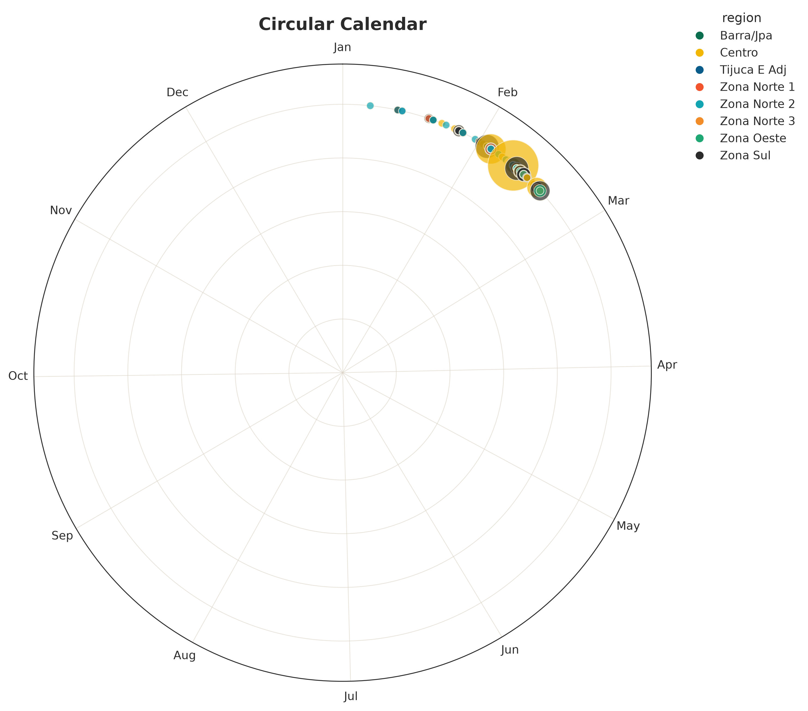

# carnaval_viz

A lightweight, Rio Carnival-inspired Python visualization library. It creates two polished, presentation-ready charts — a bubble chart and a circular calendar — with minimal configuration, built on top of pandas and Matplotlib.

<p align="center">
  
  
</p>

## Installation

```bash
pip install -e .
```

(This project is not yet published to PyPI — see [Development](#development) below to install it locally in "editable" mode, meaning changes to the source code take effect immediately without reinstalling.)

## Quick start

```python
import pandas as pd
import carnaval_viz as viz

df = pd.read_csv("examples/rio_carnival_blocos.csv")

bubble_fig = viz.bubble_chart(
    df,
    x="year_founded",
    y="estimated_audience",
    size="estimated_audience",
    color="region",
)
bubble_fig.show()

calendar_fig = viz.circular_calendar(
    df, date="event_date", size="estimated_audience", color="region",
)
calendar_fig.show()
```

Both functions return a Matplotlib `Figure` (rather than displaying anything automatically), so you can save them:

```python
bubble_fig.savefig("bubble_chart.png", dpi=300, bbox_inches="tight")
calendar_fig.savefig("circular_calendar.png", dpi=300, bbox_inches="tight")
```

## API

### `viz.bubble_chart(df, x, y, size, color, *, title=None, figsize=(10, 8), alpha=0.7, annotate_top=0)`

Plots one bubble per row: `x`/`y` position, bubble size from `size` (scaled automatically), and color from the category in `color`. Missing values are dropped automatically. `annotate_top` labels the N largest bubbles (by `size`) with their DataFrame index. Raises `TypeError`/`KeyError`/`ValueError` with a clear message for invalid input (not a DataFrame, missing/non-numeric columns, empty dataset, or no usable rows).

### `viz.circular_calendar(df, date, size, color, *, title=None, figsize=(10, 10))`

Plots one point per row around a circular (polar) calendar: angular position from `date` (parsed automatically and mapped onto the calendar year), point size from `size`, and color from the category in `color`. All points sit at the same distance from the center — the circle represents *when* in the year something happens, not a magnitude.

## Dataset

The example dataset (`examples/rio_carnival_blocos.csv`) is a real 2018 Rio de Janeiro street-Carnival ("bloco") parade schedule, cleaned from the raw file `examples/Agenda_BL_Rua_Carnaval_Rio-2018_Imprensa.csv` by `examples/prepare_dataset.py`. That script fixes several real-world data-quality quirks: semicolon-separated fields, Brazilian-style thousands separators in numbers (e.g. `"1.500"` means 1,500, not 1.5), and inconsistent capitalization in the region column.

**This dataset's original source/license is not documented.** It's included here for demonstration purposes only — if you plan to redistribute this project, verify (or replace) the dataset's licensing first.

## Development

Clone the repository, then install it in editable mode along with development tools (testing, building, and linting utilities):

```bash
python -m pip install -e ".[dev]"
```

### Testing

```bash
python -m pytest
```

### Regenerating the cleaned dataset and example images

```bash
python examples/prepare_dataset.py
python examples/rio_carnival_demo.py
```

### Building the package

```bash
python -m build
python -m twine check dist/*
```

This produces a wheel (`.whl`, a pre-built package format) and a source distribution (`.tar.gz`) in `dist/`, and `twine check` verifies they're valid for publishing (no actual publishing happens as part of this).

## License

The **software** is released under the [MIT License](LICENSE). The **example dataset**'s license is undocumented (see [Dataset](#dataset) above) — treat it as demonstration-only.
