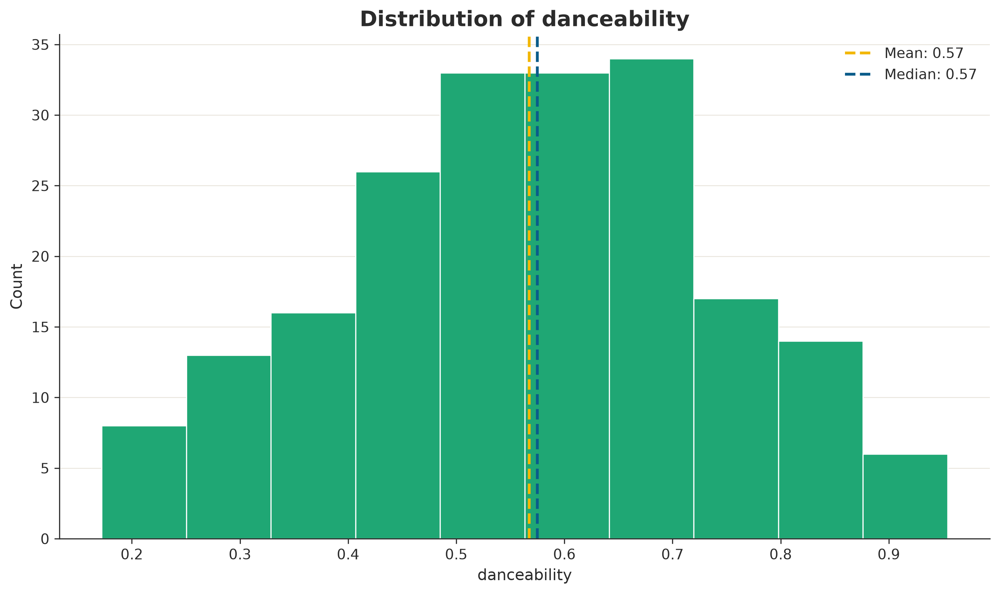
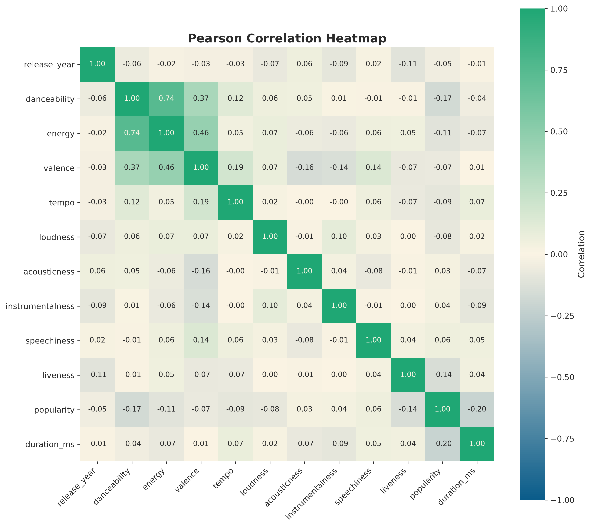

# carnaval_viz

A lightweight, Brazil-inspired Python visualization library. It creates two polished, presentation-ready charts — a histogram and a correlation heatmap — with minimal configuration, built on top of pandas and Matplotlib.

<p align="center">
  
  
</p>

## Installation

```bash
pip install -e .
```

(This project is not yet published to PyPI — see [Development](#development) below to install it locally in "editable" mode, meaning changes to the source code take effect immediately without reinstalling.)

## Quick start

```python
import pandas as pd
import carnaval_viz as viz

df = pd.read_csv("examples/brazilian_music_sample.csv")

hist_fig = viz.histogram(df, "danceability")
hist_fig.show()

corr_fig = viz.correlation(df)
corr_fig.show()
```

Both functions return a Matplotlib `Figure` (rather than displaying anything automatically), so you can save them:

```python
hist_fig.savefig("danceability_histogram.png", dpi=300, bbox_inches="tight")
corr_fig.savefig("music_correlation.png", dpi=300, bbox_inches="tight")
```

## API

### `viz.histogram(df, column, *, bins="auto", title=None, xlabel=None, show_mean=True, show_median=True, figsize=(10, 6))`

Plots the distribution of one numeric column, with optional mean/median reference lines. Missing values are dropped automatically. Raises `TypeError`/`KeyError`/`ValueError` with a clear message if the input is invalid (not a DataFrame, missing column, non-numeric column, or no usable values).

### `viz.correlation(df, *, method="pearson", annotate=True, title=None, figsize=None)`

Plots a correlation heatmap across all numeric columns in a DataFrame (non-numeric columns are ignored automatically). Supports `"pearson"`, `"spearman"`, and `"kendall"` correlation methods. Requires at least two usable numeric columns.

## Dataset

The example dataset (`examples/brazilian_music_sample.csv`) is **synthetic** — it is randomly generated by `examples/generate_dataset.py` (with a fixed random seed, so it's reproducible), not sourced from any real streaming service or API. It was built this way specifically to avoid dataset-licensing questions while still giving realistic-looking audio-feature columns (danceability, energy, tempo, valence, etc.) modeled after real-world ranges.

If you want to swap in a real, licensed Brazilian-music dataset later, just point `pd.read_csv(...)` at it — both functions work with any DataFrame containing numeric columns.

## Development

Clone the repository, then install it in editable mode along with development tools (testing, building, and linting utilities):

```bash
python -m pip install -e ".[dev]"
```

### Testing

```bash
python -m pytest
```

### Regenerating the example dataset and images

```bash
python examples/generate_dataset.py
python examples/brazil_music_demo.py
```

### Building the package

```bash
python -m build
python -m twine check dist/*
```

This produces a wheel (`.whl`, a pre-built package format) and a source distribution (`.tar.gz`) in `dist/`, and `twine check` verifies they're valid for publishing (no actual publishing happens as part of this).

## License

The **software** is released under the [MIT License](LICENSE). The **example dataset** is synthetic, generated by this project, and not subject to any third-party license.
